# ¡Hola! 👋 Soy Diego Martín Arellano

Soy un apasionado de la tecnología especializado en **Desarrollo Full-Stack** y **Administración de Sistemas**. Me dedico constantemente a mejorar mis habilidades y a adaptarme a nuevas herramientas y metodologías, para contribuir a proyectos innovadores y de alto impacto.

---

## 📊 GitHub Stats

Se generan con GitHub Actions y se guardan como SVG estático en el repositorio, así no dependen de una API pública en cada visita. Si añades un secreto `GH_STATS_TOKEN` con permisos `repo` y `read:user`, también podrá incluir datos privados como antes.

---

## 🛠️ Tecnologías

### Backend Core

### Frontend

### Data & Messaging

### Cloud & Infrastructure

### CI/CD & Monitoreo

---

## 🎯 Habilidades

✅ Desarrollo Web Full-Stack  
✅ Administración de Sistemas  
✅ Microservicios con Java y Spring Boot  
✅ Computación en la Nube (AWS)  
✅ Inglés Nivel Intermedio  
✅ Certificaciones: Angular & Spring Boot, React & Spring Boot, Cisco CCNA, Mikrotik MTCNA  

---

## 📞 Contacta Conmigo

- 📧 **Email:** [diegoma2933@gmail.com](mailto:diegoma2933@gmail.com)
- 🌐 **Sitio Web:** [www.diegomartinarellano.com](https://www.diegomartinarellano.com)
- 💼 **LinkedIn:** [linkedin.com/in/diego-martin-arellano](https://linkedin.com/in/diego-martin-arellano)

---

**¡Gracias por visitar mi perfil! Si te interesa colaborar o tienes alguna pregunta, no dudes en contactarme.** 🚀
